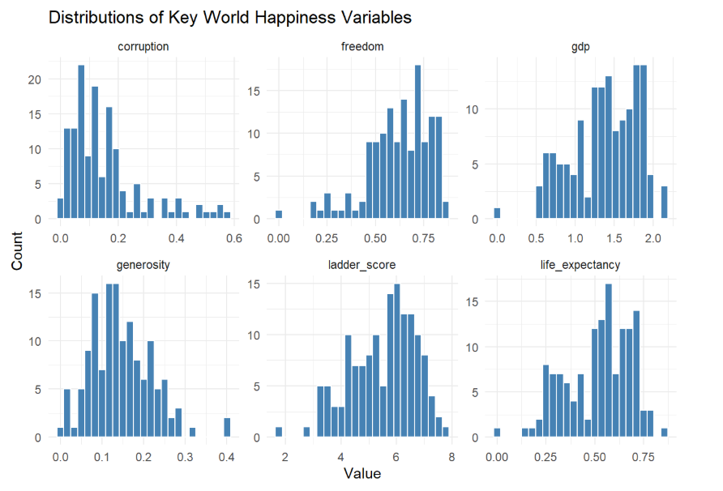
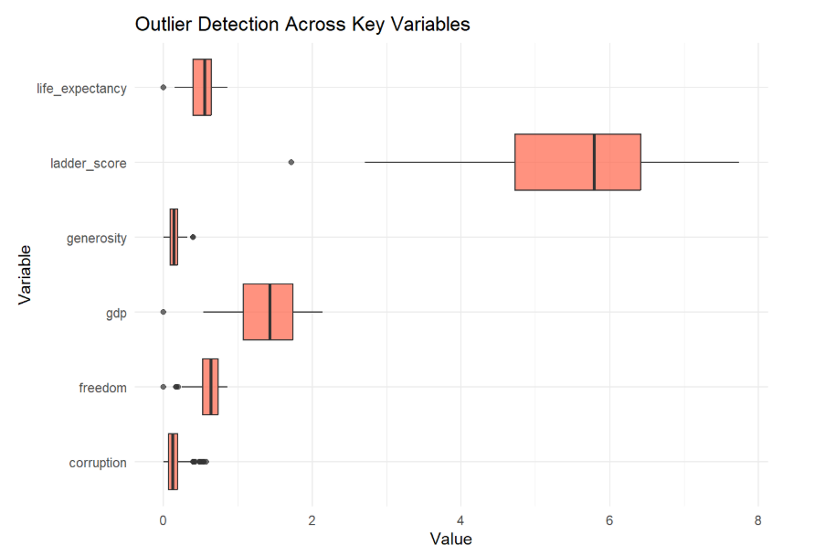

# World Happiness Report EDA

Exploratory Data Analysis of a World Happiness Report using **R** and **tidyverse**.
Dataset source: https://www.kaggle.com/datasets/ajaypalsinghlo/world-happiness-report-2024

---

**Author:** Joshua Kohlmeyer  
**Dataset:** World Happiness Report 2024  
**Countries:** 143  
**Features:** 11  

---

## Project Overview

My aim with this project was to present a full exploratory data analysis (EDA) of a 2024 World Happiness Report. I investigated the main factors associated with national happiness and applied the **full EDA process** using **R**, as outlined (and well-taught) in my University of Pretoria WST221 module.

I did this to gain practical experience working with real-world data in **R**. The goal was to uncover which factors most strongly explain international differences in happiness.

---

## Dataset Description

The main variables used in the analysis were:

- **ladder_score** – Overall happiness score  
- **gdp** – Log GDP per capita  
- **life_expectancy** – Healthy life expectancy  
- **social_support** – Perceived social support  
- **freedom** – Freedom to make life choices  
- **generosity** – Generosity score  
- **corruption** – Perceived corruption  
- **dystopia_residual** – Unexplained component of happiness  

---

## Analysis Workflow

1. Loaded and cleaned the dataset in R (using tidyverse)  
2. Renamed variables for improved readability  
3. Looked at distributions using histograms (awesome function; applied coursework theory here)  
4. Detected outliers using boxplots (underrated graph)  
5. Built a correlation heatmap (never disappoints when checking for correlation between variables)  
6. Interpreted the results in plain English (for clear communication of results)  

All the analysis was done using **tidyverse** and documented using **RMarkdown**.

---

## Code Output

The full rendered analysis is available here:

https://joshuakohlmeyer.github.io/World-Happiness-Report-EDA/

---

## Visual Highlights

### Key Variable Distributions

### Outlier Detection

---

## Key Findings

### Strongest drivers of happiness
- GDP per capita  
- Healthy life expectancy  

Both variables showed very strong positive correlations (approximately 0.75 to 0.85) with happiness.

### Weakest relationship
- Generosity  

Generosity showed near-zero correlation with happiness across countries, which was interesting and quite unexpected.

### Negative relationship
- Corruption  

As expected, higher perceived corruption is associated with lower happiness (correlation approximately -0.4 to -0.5, clear negative relationship).

### Distributions and outliers
- Happiness and GDP had the widest spread and strongest outliers  
- Corruption and generosity were much more tightly distributed  

---

## Final Conclusion

National happiness is driven primarily by economic strength and population health, while social generosity plays a minimal role in happiness across countries. Corruption consistently reduces well-being across nations.

---

## What I Learnt

- Economic success and people’s health dominate national well-being  
- Not all “positive” traits (like generosity) translate directly into higher happiness  
- Visualization and correlation analysis are essential in making sense of real data  

---

## Tools

- R  
- tidyverse  
- RMarkdown  
- Git and GitHub  

---

## Project Files

- World-Happiness-Report-eda.Rmd  
- data.csv  
- README.md  
- World-Happiness-Report-EDA.Rproj  

---

## Contact

If you would like to connect or give feedback on this project (much appreciated):

- LinkedIn: https://www.linkedin.com/in/joshua-kohlmeyer/  
- GitHub: https://github.com/JoshuaKohlmeyer

##
